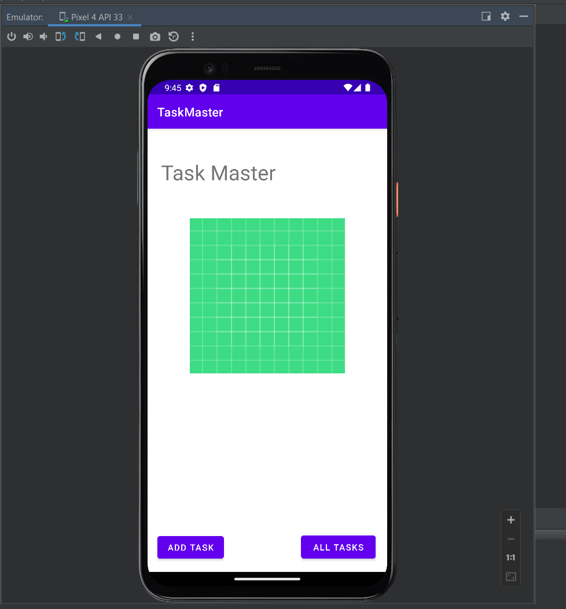
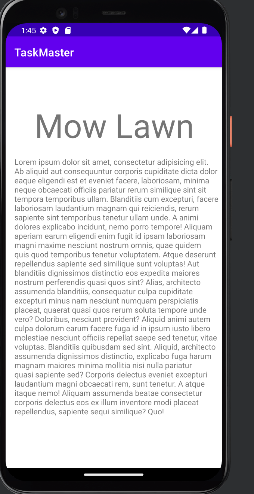
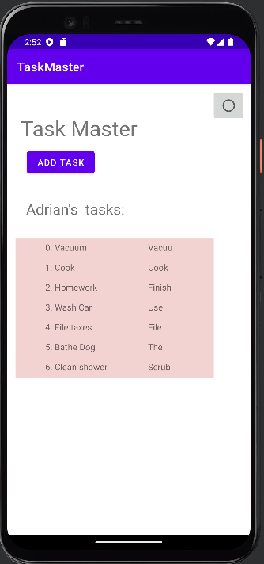

# Task Manager

## Change Log

- 12/01/2022
  - Added home page
  - Added add task page
  - Added all tasks page
  - Added event handlers for submit task button
  - Added back arrow on all tasks page
  - Added placeholder images
  - Added navigation buttons to home page

- 12/02/2022
  - Added task details page
  - Added event handlers for task details page
  - Added espresso tests for task details page and settings page
  - Added settings page
  - Added event handlers for settings page
  - Added tasks on home page

- 12/05/2022
  - Added Task model
  - Added Recycler View to homepage
  - Removed individual task buttons from homepage

- 12/06/2022
  - Added room database
  - Added task dao
  - Added status to task creation

- 12/08/2022
  - Removed room database
  - Added amplify database
  - Added queries and mutations for amplify database
  
- 12/12/2022
  - Added teams to tasks
  - Added teams to settings page
  - You now only see tasks that are assigned to your team

- 12/13/2022
  - Added authentication with aws cognito
  - Added sign in page
  - Added sign up page
  - Added sign out button
  - Added verify account page
  - Removed unnecessary code

- 12/14/2022
  - Added amplify storage
  - Added image upload to task creation
  - Added image to task details page

## Previews

### Home Page

### Task Details Page

### Recycler View

